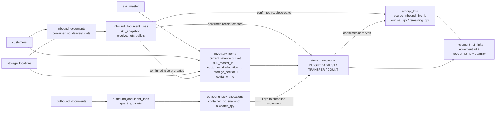
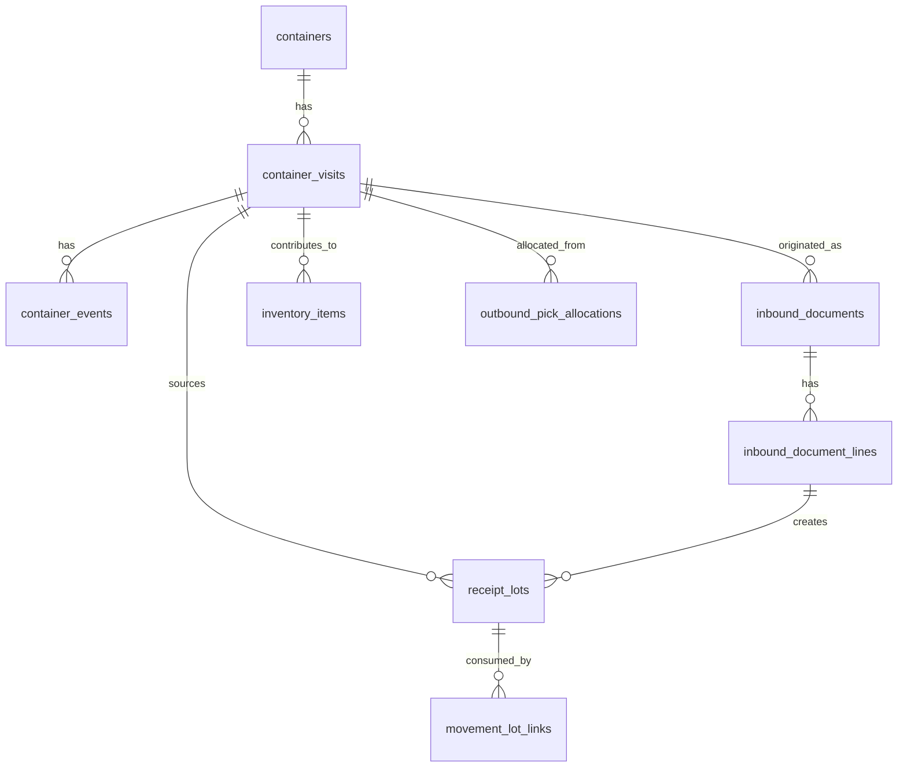
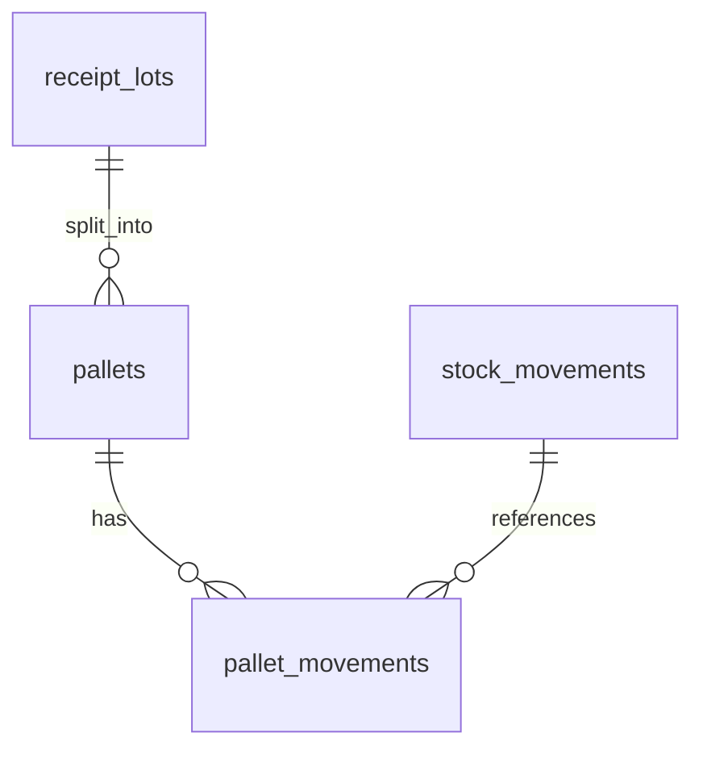

# Traceability Model

This document summarizes:

1. What the current database can trace today.
2. Where the current traceability stops.
3. The smallest schema additions needed to support fuller container-level traceability.
4. The optional next step for pallet/LPN-level traceability.

## Current Traceability Chain

### Container and inventory quantity lineage

### What this means in practice

Today the system can usually answer:

- Which container a confirmed inbound document belonged to.
- Which customer, warehouse, section, and SKU a current inventory bucket belongs to.
- Which inbound line originally created a receipt lot.
- Which later movements consumed or moved that receipt lot quantity.
- Which outbound allocation row was associated with a container snapshot.
- Which billing rows were derived from inbound containers and outbound pallet events.

## What Is Fully Traceable Today

### Good coverage

- **Container at inbound document level**
  - A container number is recorded on the inbound document.
- **Current inventory by container**
  - `inventory_items` stores `container_no` as part of the balance bucket.
- **Quantity lineage from inbound to later movements**
  - `receipt_lots` plus `movement_lot_links` provides quantity-based lineage.
- **Outbound container snapshots**
  - `outbound_pick_allocations.container_no_snapshot` preserves what container the allocation came from.
- **Billing by container**
  - The current billing implementation groups inbound, outbound, and storage balances by normalized `container_no`.

## Where Current Traceability Is Incomplete

### 1. No first-class container lifecycle

There is no dedicated `containers` or `container_visits` table today.

That means a container number is just a string copied into multiple tables:

- `inbound_documents.container_no`
- `inventory_items.container_no`
- `stock_movements.container_no`
- `receipt_lots.container_no`
- `outbound_pick_allocations.container_no_snapshot`

Because of that, the system cannot model container lifecycle as its own entity:

- Arrived at gate
- Docked
- Unloaded
- Put away
- Closed out
- Reopened or returned

### 2. No guarantee that every historical movement has receipt-lot lineage

For newer flows, quantity lineage is strong. But legacy inventory can still exist without full lot linkage.

The code explicitly allows this during consumption:

- if no open receipt lots exist, the movement stays valid, but lot-link generation is skipped

So the system can have valid inventory history that is not fully back-linked to an inbound source.

### 3. Inventory is traceable by balance bucket, not by physical pallet or unit

`inventory_items` is a balance record, not a physical object record.

So the system can trace:

- quantity
- customer
- location
- section
- container
- dates

But not:

- exact pallet identity
- exact box identity
- exact serial/unit identity

## KISS Conclusion

The current model is already good enough for:

- **container-level operational tracing**
- **inventory quantity lineage**
- **container-based monthly billing**

It is **not** yet a full physical traceability model for:

- repeated visits of the same container number over time
- every historical movement without lineage gaps
- pallet/LPN-level audit

## Minimal Additions For Fuller Container-Level Traceability

If the goal is:

- fully trace each container visit
- keep the database simple
- keep business logic in the application layer

then the smallest useful additions are these two tables.

### Proposed target

### 1. `containers`

Purpose:

- stable master record for a real container number

Suggested fields:

- `id`
- `container_no`
- `container_type`
- `notes`
- `created_at`
- `updated_at`

This table answers:

- have we seen this container before
- what is the canonical normalized container number

### 2. `container_visits`

Purpose:

- one operational visit of one container into the warehouse

Suggested fields:

- `id`
- `container_id`
- `customer_id`
- `location_id`
- `inbound_document_id`
- `arrival_date`
- `received_date`
- `closed_date`
- `status`
- `created_at`
- `updated_at`

This is the table that turns a reused container number into separate warehouse visits.

It answers:

- which exact visit generated this inventory
- whether this visit is still open
- what dates should be used for billing and traceability

### 3. `container_events`

Purpose:

- optional but very useful event log for container lifecycle

Suggested fields:

- `id`
- `container_visit_id`
- `event_type`
- `event_time`
- `note`
- `reference_type`
- `reference_id`

This table gives you:

- arrived
- docked
- unloading started
- unloading completed
- putaway completed
- visit closed

without overloading business tables.

## Application-Level Rules To Make This Work

To keep the schema simple, the most important improvements are actually application rules:

### Rule 1

Every confirmed inbound document with a non-empty `container_no` must resolve to:

- one `containers` row
- one `container_visits` row

### Rule 2

Every confirmed inbound line must create:

- a `receipt_lot`

No exceptions for new data.

### Rule 3

Every outbound allocation must either:

- point to a container visit directly
- or be derivable through receipt-lot lineage without ambiguity

### Rule 4

Legacy no-lineage inventory should be marked and phased out, not silently mixed into future “fully traceable” flows.

## If You Want True Physical Traceability Later

Only add this if the business really needs it.

### Optional `pallets` / `lpns`

Suggested tables:

- `pallets`
- `pallet_movements`

Use these only when you need:

- pallet-day by physical pallet
- exact pallet exit date
- pallet relabel / split / merge
- customer disputes at pallet identity level

## Recommended Rollout Order

### Phase 1

Add:

- `containers`
- `container_visits`

and connect all new inbound receipts to them.

### Phase 2

Add:

- `container_events`

and make the daily operations page read from them.

### Phase 3

Enforce strict lineage:

- all new inventory must originate from `receipt_lots`
- no silent fallback for newly created stock

### Phase 4

Only if needed:

- `pallets`
- `pallet_movements`

## Final Answer

### Can the current database completely trace each container and each inventory record?

**Not completely.**

### What can it do well today?

- Container-level tracing by document, balance bucket, movement, and billing
- Quantity lineage from inbound to outbound through `receipt_lots`

### What is still missing for fuller traceability?

- First-class container visit lifecycle
- strict no-gap lineage for all new stock
- pallet/LPN identity if you need physical-object-level tracing
